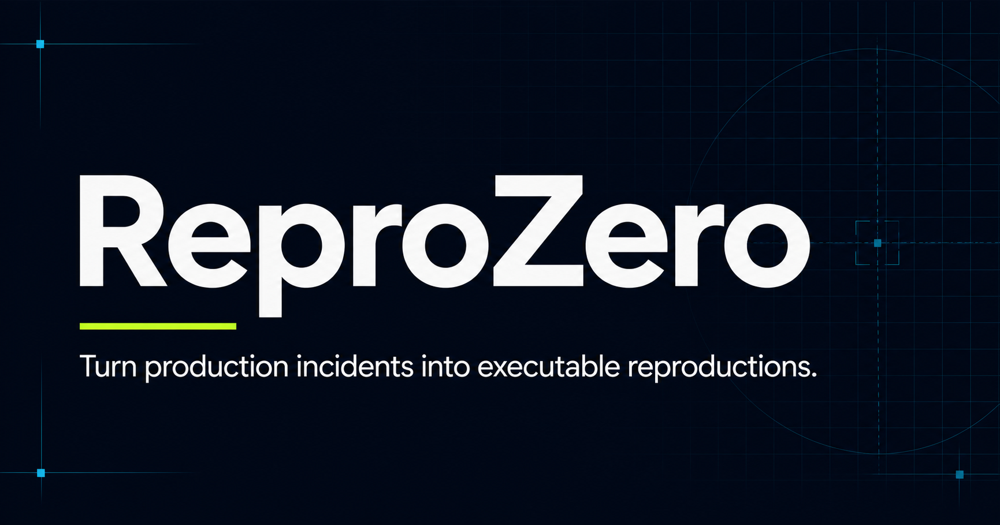

# ReproZero

> **Tickets describe failures. ReproZero makes them run.**

[Live app](https://reprozero.vercel.app/) · [Worked example (no login)](https://reprozero.vercel.app/showcase/dit-1842) · [Executable AWS demo repo](https://github.com/Avantiikaa16/ReproZero_AWS_Demo)



Most production bugs get closed on a hunch. Reproducing the failure — piecing together
logs, guessing at repro steps, rebuilding the exact environment — often takes longer than
writing the fix, so people skip it, ship a plausible change, and hope.

ReproZero closes that gap. Given the evidence from a ticket, it compiles an executable
reproduction, runs it in an isolated sandbox, and proves whether a candidate fix actually
resolves it — with real before/after test results, not a plausible-sounding explanation.

---

## What it is

A multi-tenant web application (not a single-page demo). It has:

- **Accounts and workspaces** — Clerk authentication with Organizations; every incident,
  run, integration, and audit event is workspace-scoped.
- **Incident lifecycle** — a 10-state status model, assignment, a timeline (notes,
  evidence requests, system events), reopen tracking, and a downloadable evidence bundle.
- **Jira integration** — Jira Cloud OAuth 2.0 (3LO). Import a ticket as an incident,
  keep an append-only snapshot history, and write back a comment or a status transition —
  always behind an explicit confirmation screen showing the exact target and content.
  Real-time sync via dynamically-registered webhooks, refreshed by a daily cron so they
  never silently expire.
- **GitHub integration** — GitHub OAuth App. Create a branch, or open a draft pull
  request, from an incident — again behind an explicit confirmation before any write.
- **Real sandboxed reproduction** — the AWS firewall-deletion scenario runs for real in a
  short-lived [Vercel Sandbox](https://vercel.com/docs/vercel-sandbox) microVM: clone a
  pinned commit, `npm install`, `npm test`, `npm run verify`, with the real pass/fail
  counts parsed back out. See [what's real vs. simulated](#whats-real-vs-simulated).
- **Reproduction adapters** — a `canHandle`/`run` adapter interface with six incident
  types (AWS resource-cleanup race, Stripe webhook ordering, API pagination duplication,
  a failing unit test, config/environment mismatch, database migration failure).
- **Hosted memory** — every verified repair is stored with its root cause, code path, and
  evidence; keyword-overlap matching surfaces past incidents sharing a root cause, and
  every match lists the exact terms that matched (no black box).
- **Audit log** — every security-sensitive action (integration connects/disconnects,
  external writes, status/assignment changes, public-share toggles) is recorded.
- **Public showcase** — any one incident can be opted in, per link, to a read-only public
  page (`/showcase/<slug>`) with no login — evidence, verdict, patch, and timeline, but
  none of the app controls or workspace internals.

## Provider-agnostic by design

Jira is treated as the *first* evidence adapter, not the core data model. `integration_connections`
has a plain-string `provider` and a jsonb `config` — adding Linear, PagerDuty, or a raw
webhook never requires a schema migration. Incidents reference a connection generically;
no `jira_*` column exists on any core table.

## Demo incident: DIT-1842

A managed firewall becomes stuck in `DELETING` after a dependent VPC is removed. The
deletion workflow cleans up the Elastic IP and subnet, then calls `deleteVpc`; AWS returns
`ResourceNotFound`, and the workflow exits before terminating the instance or advancing the
firewall to `DELETED`.

```text
EC2 firewall     Elastic IP        Subnet            VPC
DELETING    →    DISASSOCIATED  →  DELETED      →    NOT FOUND
                                                       ↓
                                             ResourceNotFound → exit 1
```

The proposed fix makes cleanup idempotent: an already-absent dependency is treated as
successfully deleted, while every other error is still rethrown. The same environment is
replayed in a fresh sandbox, cleanup completes, and the firewall reaches `DELETED` with
`2/2` tests passing.

See it end to end, no login required: **[reprozero.vercel.app/showcase/dit-1842](https://reprozero.vercel.app/showcase/dit-1842)**

## Tech stack

| Area | Choice |
| --- | --- |
| Framework | Next.js 16 (App Router, Turbopack), deployed on Vercel |
| Auth | Clerk (`@clerk/nextjs`) with Organizations |
| Database | Neon Postgres (serverless HTTP driver) + Drizzle ORM — 12 tables, 6 migrations |
| Sandboxed execution | `@vercel/sandbox` — isolated microVMs |
| Validation | Zod on every mutation route |
| Secrets at rest | AES-256-GCM (`node:crypto`) for OAuth tokens |
| Tests | Vitest + jsdom (34 tests) |

## What's real vs. simulated

ReproZero is deliberate about not overstating what runs. Every reproduction run is
labeled `live_sandbox` or `demo_simulation`, and the label reflects reality:

- **Genuinely executed:** the AWS firewall-deletion scenario. It clones
  [ReproZero_AWS_Demo](https://github.com/Avantiikaa16/ReproZero_AWS_Demo) at a pinned
  commit into a real sandbox and runs its actual tests and verification script. Its tests
  are self-contained against an in-memory fake AWS client — no real cloud resources are
  ever provisioned or mutated.
- **Honest simulations:** the other five adapter types. They model realistic ReproSpecs,
  failures, patches, and verification data, and are always shown as `demo_simulation` —
  never dressed up as live.
- **OpenAI / Greptile / Claude-Mem** run live when their keys are configured and fall
  back to a labeled deterministic adapter otherwise.
- The marketing page's inline "Reproduce an incident" widget is the deterministic
  simulation; the `/showcase` page shows a genuinely sandbox-executed result.

## Local development

Requirements: Node.js 22.13+ and npm. A Neon (or any Postgres) database and a Clerk
application are needed for the authenticated app; the public marketing page and the
`/api/reproduce` demo run without them.

```bash
git clone https://github.com/Avantiikaa16/ReproZero.git
cd ReproZero/apps/web
npm ci
cp .env.example .env.local      # PowerShell: Copy-Item .env.example .env.local
# fill in .env.local, then:
npm run db:migrate              # apply schema to your database
npm run dev
```

### Environment variables

`apps/web/.env.example` is the source of truth. The essentials:

```dotenv
# App
APP_BASE_URL=http://localhost:3000

# Clerk (authenticated app)
NEXT_PUBLIC_CLERK_PUBLISHABLE_KEY=
CLERK_SECRET_KEY=
CLERK_WEBHOOK_SECRET=

# Database
DATABASE_URL=
DATABASE_URL_UNPOOLED=          # direct connection, used by migrations

# Encrypts integration OAuth tokens at rest — openssl rand -base64 32
TOKEN_ENCRYPTION_KEY=

# Jira Cloud OAuth (optional)   callback {APP_BASE_URL}/api/integrations/jira/callback
JIRA_OAUTH_CLIENT_ID=
JIRA_OAUTH_CLIENT_SECRET=

# GitHub OAuth App (optional)   callback {APP_BASE_URL}/api/integrations/github/callback
GITHUB_OAUTH_CLIENT_ID=
GITHUB_OAUTH_CLIENT_SECRET=

# Runtime reasoning / evidence (optional — labeled fallbacks when unset)
OPENAI_API_KEY=
GREPTILE_API_KEY=
STRIPE_SECRET_KEY=
STRIPE_WEBHOOK_SECRET=
CLAUDE_MEM_BASE_URL=

# Authenticates Vercel Cron's daily Jira-webhook refresh (optional)
CRON_SECRET=
```

Never commit `.env.local` or paste credentials into issues, screenshots, or chat. Secret
files are gitignored.

## Verification

```bash
cd apps/web
npm run lint
npm run test        # Vitest
npx next build
```

The executable AWS demo (separate repo):

```bash
git clone https://github.com/Avantiikaa16/ReproZero_AWS_Demo.git
cd ReproZero_AWS_Demo && npm test   # expect 2 passing tests
```

## Repository layout

```text
ReproZero/
├── apps/web/                  # the application — everything below is here
│   ├── app/
│   │   ├── (marketing)/       # public landing page + /showcase/[slug]
│   │   ├── (auth)/            # Clerk sign-in / sign-up
│   │   ├── (app)/             # authenticated workspace (7 pages)
│   │   └── api/               # 33 route handlers
│   ├── app/lib/               # auth context, audit, crypto, adapters, integrations
│   ├── db/                    # Drizzle schema (12 tables) + migrations
│   ├── middleware.ts          # Clerk route protection
│   └── test/                  # Vitest suite
├── docs/                      # early architecture / scope notes
├── integrations/              # per-integration design notes
├── packages/ · services/      # early direction notes (not built out)
```

Key files:

```text
apps/web/middleware.ts                        # route protection + which API routes get auth context
apps/web/db/schema/                           # provider-agnostic data model
apps/web/app/lib/auth-context.ts              # requireWorkspaceContext() — the single authz gate
apps/web/app/lib/secret-crypto.ts             # AES-256-GCM token encryption
apps/web/app/lib/jira-adapter.ts              # Jira OAuth, search, import, write-back, webhooks
apps/web/app/lib/github-adapter.ts            # GitHub OAuth, branch/PR creation
apps/web/app/lib/sandbox-runner.ts            # real @vercel/sandbox execution
apps/web/app/lib/adapters/                    # the six reproduction adapters
apps/web/app/lib/memory-store.ts              # hosted memory + similarity matching
apps/web/app/api/reproduce/route.ts           # public demo endpoint (rate-limited, size-capped)
```

## Roadmap

- More evidence adapters (Linear, PagerDuty, CI, observability)
- Genuine sandbox execution for more than one scenario type
- Push the candidate patch to the created branch automatically
- Secret redaction and a policy-approval step before any external execution
- Metrics: time-to-reproduction, tokens saved, resolution-time improvement

**Every escalated incident should become a portable failing test.**
